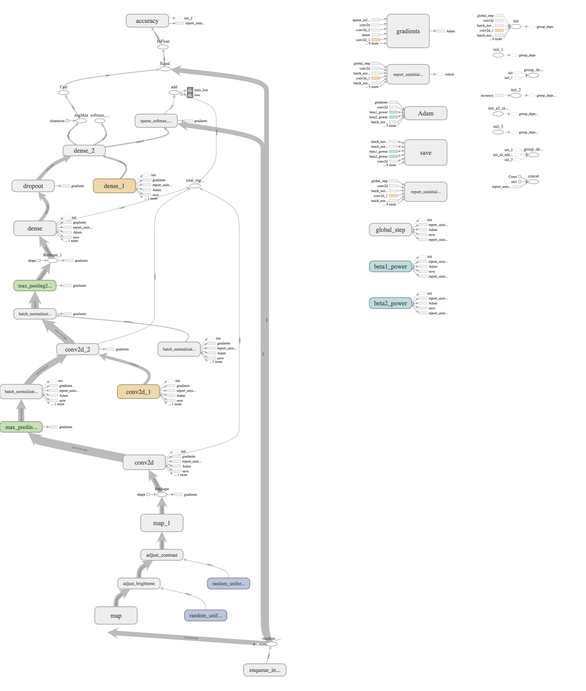

# Recognize images in Cifar-10 using ConvNet
### Group Members
| Name | Uni |
|:----:| :-: |
|Shuo Jiang | sj2363 |
Willian Zhang|yz3575
### Architecture

### Training Accuracy
`0.85`
### Test Accuracy
`0.77`
### Duration of Training
`36000` Tensorflow Steps(`batch size` is `200`)
### Size of Training Data
`36000` images(`80%` of the training data) with randomly distortion for each image
### Total Training Loss
Not recorded yet
### Training Accuracy
Not recorded yet
### Histogram of Weight Gradient
#### Conv Layer
Not recorded, sorry.
#### Last Full-Connected Layer
Not recorded, sorry.